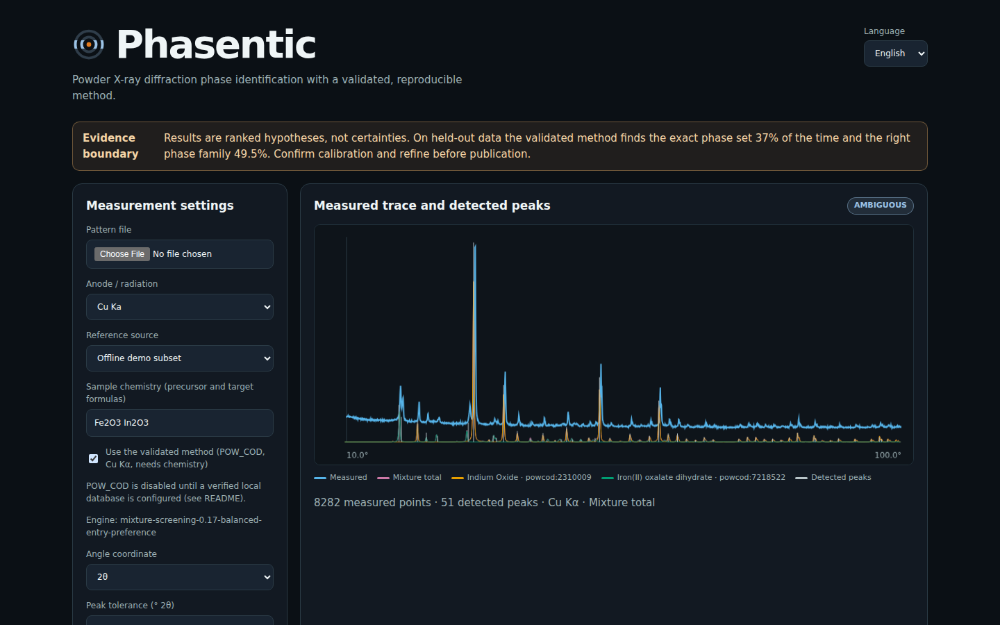

<p align="center">
  <picture>
    <source media="(prefers-color-scheme: dark)" srcset="../assets/wordmark-dark.svg">
    
  </picture>
</p>

<p align="center">
  Identification de phases par diffraction des rayons X sur poudre, avec une méthode validée et reproductible.
</p>

<p align="center">
  <a href="../README.md">English</a> | <a href="README_es.md">Español</a> | <b>Français</b> | <a href="README_cn.md">简体中文</a> | <a href="README_ar.md">العربية</a> | <a href="README_de.md">Deutsch</a>
</p>

<p align="center">
  
  <a href="../LICENSE"></a>
</p>

<p align="center">
  <a href="#install">Installation</a> ·
  <a href="#quick-start">Démarrage rapide</a> ·
  <a href="#how-accurate-is-it">Validation</a> ·
  <a href="../docs/">Documentation</a> ·
  <a href="#how-this-was-built">Genèse du projet</a>
</p>

Phasentic lit un diffractogramme de poudre (`.xy`, `.xrdml` ou `.raw` ASCII),
détecte les pics, interroge la base de données de référence
[POW_COD](https://www.ba.ic.cnr.it/softwareic/qualx/) du CNR et ajuste des
mélanges d’au plus cinq phases. Il renvoie des hypothèses de phases
classées, et consigne dans un rapport JSON chaque paramètre, chaque empreinte
(hash) et chaque avertissement. Il s’exécute en local, dans le navigateur ou en
ligne de commande.

<p align="center">
  
  <br>
  <sub>Un diffractogramme de développement du jeu de données Precursor Genome (PG_2452, Cu Kα), tiré au hasard. Phasentic trouve ZrO₂ et LiOH·H₂O ; l’étiquette affinée par un expert humain contient aussi Li₂CO₃, que cette analyse ne détecte pas. Le signal résiduel est visible sous <i>Evidence per phase</i> (éléments probants par phase).</sub>
</p>

<a name="how-accurate-is-it"></a>

## Quelle est sa fiabilité ?

La méthode a été figée avant les tests, avec un objectif déclaré à l’avance,
puis exécutée une seule fois sur 200 diffractogrammes qu’elle n’avait jamais vus
(Precursor Genome, étiquettes affinées par des experts humains). Les abstentions
comptent comme des échecs.

| Niveau | Corrects | Taux | Intervalle à 95 % (Wilson) | Objectif déclaré |
|---|---|---|---|---|
| Bons composés et bonnes structures cristallines (strict) | 74 / 200 | 37.0% | 30.6–43.9% | ≥ 35% |
| Bons composés, polymorphe quelconque (family) | 99 / 200 | 49.5% | 42.6–56.4% | ≥ 45% |

Les deux estimations ponctuelles atteignent leur objectif ; les deux bornes
inférieures restent en dessous. Le taux de réussite dépend fortement du nombre de phases :

| Phases dans l’échantillon | Diffractogrammes | Corrects (niveau family) |
|---|---|---|
| 1 | 8 | 3 |
| 2 | 125 | 87 (70%) |
| 3 ou plus | 67 | 9 (13%) |

Le protocole, l’évaluation antérieure sur jeu de test indépendant mis de côté (32% / 42% pour la
version précédente), l’analyse des échecs et les justificatifs se trouvent dans
[docs/validation.md](../docs/validation.md). Ces chiffres valent pour la
configuration validée avec POW_COD, Cu Kα et la chimie des précurseurs de
l’échantillon ; les autres réglages n’ont pas été testés.

<a name="install"></a>

## Installation

Python 3.10–3.13 est requis. La méthode la plus simple installe la commande
`phasentic` dans son propre environnement :

```bash
pipx install git+https://github.com/qaemu/phasentic
```

ou, avec [uv](https://docs.astral.sh/uv/) : `uv tool install git+https://github.com/qaemu/phasentic`,
ou avec pip seul : `pip install git+https://github.com/qaemu/phasentic`.

Vérifier que l’installation a fonctionné :

```bash
phasentic --version
```

### Ajouter la base de référence POW_COD (une seule fois)

Sans POW_COD, Phasentic fonctionne sur un sous-ensemble de démonstration de
trois phases, qui ne sert qu’à essayer l’interface. Pour un usage réel :

1. Télécharger **POW_COD 2205 (FULL)** (environ 1.9 GB) depuis la
   [page de téléchargement du CNR](https://www.ba.ic.cnr.it/softwareic/qualx/download/powcod-2205/).
2. Exécuter :

   ```bash
   phasentic setup-powcod ~/Downloads/powcod-2205.zip
   ```

Cette commande vérifie l’archive, l’extrait dans `~/.phasentic/powcod` (environ
6 GB) et construit une seule fois un cache de requêtes (20–60 minutes). Ensuite,
Phasentic utilise POW_COD par défaut.

<a name="quick-start"></a>

## Démarrage rapide

Lancer l’interface locale et ouvrir <http://127.0.0.1:8000> :

```bash
phasentic serve
```

Choisir un diffractogramme, saisir les formules des précurseurs et de la cible,
laisser *Validated method* (méthode validée) sélectionné (option par défaut) et
cliquer sur *Analyze* (analyser). *Download report* (télécharger le rapport)
fournit un rapport imprimable de deux pages (graphique d’ajustement, éléments
probants par phase, hypothèses concurrentes, méthode et traçabilité) que l’on
peut enregistrer en PDF ; *JSON* fournit l’enregistrement complet, lisible par
machine.

En ligne de commande, la même méthode validée :

```bash
phasentic analyze scan.xrdml --preset validated --chemistry "Ag2O BaCO3 Ba2Ag2C2O7" --output report.json
```

`--chemistry` restreint les candidats aux éléments de ces formules, plus H, C
et O (carbonates, hydroxydes, hydrates). Sans `--preset`, chaque paramètre
d’analyse peut être ajusté par des options (`phasentic analyze --help`) ; ces
combinaisons ne sont pas validées.

Une décision `supported` exige en outre un étalonnage de la position des raies
à l’aide d’un diffractogramme d’étalon (silicium NIST SRM 640g par défaut) :
`phasentic calibrate standard.xy`.

## Quand ne pas l’utiliser

- **Pour prouver la présence d’une phase.** Les résultats sont des hypothèses
  classées, à confirmer par un scientifique, idéalement par affinement de Rietveld.
- **Pour les fractions de phases.** Les facteurs d’échelle de l’ajustement sont
  des amplitudes de criblage, pas des pourcentages massiques.
- **Pour les échantillons à trois phases ou plus**, pour lesquels il n’a
  identifié tous les composés que dans 13% des cas lors des tests.
- **Pour les phases minoritaires ou faiblement diffusantes** (par exemple des
  sels de Li, B ou K à côté de phases d’éléments lourds), qu’il ne détecte souvent pas.
- **Sans la chimie de l’échantillon, ou avec des anodes autres que Cu**, cas qui
  ne faisaient pas partie de la validation.

## Fonctionnement

1. Importer le diffractogramme, estimer le fond continu, détecter les pics (en
   tenant compte du bruit).
2. Extraire de POW_COD des candidats, restreints aux éléments de l’échantillon.
3. Ajuster des mélanges non négatifs de profils de référence par une recherche
   en faisceau bornée (beam search), avec nouvelles requêtes sur le résidu et
   substitutions de phases ; rejeter les phases dont les raies intenses sont
   absentes du diffractogramme.
4. Classer les hypothèses, signaler les ambiguïtés et consigner la provenance
   (empreinte de l’entrée, paramètres, identité de la base de données, versions
   des algorithmes).

Détails : [docs/scientific-method.md](../docs/scientific-method.md) et
[PARAMETERS.md](../PARAMETERS.md).

## Reproduire la validation

Cloner le dépôt et l’installer :

```bash
git clone https://github.com/qaemu/phasentic && cd phasentic
pip install -e .
```

Les exécutions validées utilisent `scripts/run_wp5_parallel.py`, qui refuse de
s’exécuter si le code d’analyse diffère de l’empreinte enregistrée dans la
configuration figée (`validation/wp5-precursor-frozen-v5.json`). Les listes de
cas des cohortes et les justificatifs des résultats se trouvent dans
[`validation/`](../validation/) ; les diffractogrammes eux-mêmes proviennent du
jeu de données [Precursor Genome](https://github.com/lauren-walters/precursor-genome)
(CC BY 4.0). Les instructions pas à pas figurent dans
[docs/validation.md](../docs/validation.md).

<a name="how-this-was-built"></a>

## Genèse du projet

Phasentic a été écrit presque entièrement par **Claude Code**, l’agent de
programmation d’Anthropic, travaillant sous ma direction. Je développe ce projet seul. J’ai choisi le problème, les méthodes et le protocole de validation,
examiné les résultats, et je suis responsable de chaque affirmation de ce dépôt.

Les éléments qui rendent ces affirmations vérifiables ont été fixés avant que les résultats ne soient connus : l’objectif de taux de réussite a été déclaré avant le réglage, le
réglage n’a utilisé que 100 diffractogrammes de développement, le jeu de test
indépendant a été scellé et exécuté une seule fois, les paramètres et le code ont été
figés par empreinte (hash), et les refactorisations ultérieures devaient
reproduire exactement les 300 résultats
([docs/validation.md](../docs/validation.md)). Les commits réalisés avec
l’assistance de l’IA portent une mention `Assisted-by: Claude Code`. Voir
[AI_USE.md](../AI_USE.md).

## Citer

Si Phasentic contribue à vos travaux, citez la version utilisée. Le bouton
*Cite this repository* de GitHub (généré à partir de [CITATION.cff](../CITATION.cff))
fournit les formats APA et BibTeX. Citez également POW_COD et la Crystallography
Open Database.

## Licence

MIT pour le code. Les données POW_COD, COD et Precursor Genome sont distribuées
selon leurs propres conditions et ne sont pas incluses dans ce dépôt.
